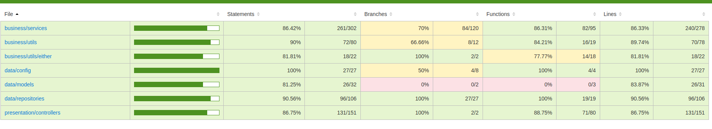
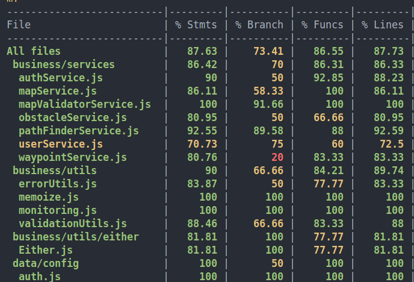

# Capstone Project - API Path Finder


## Instalación

Para instalar y ejecutar la API, sigue estos pasos:

1. Clona el repositorio:

```bash
git clone https://gitlab.com/CarlosMGG/capstone.git
cd capstone
```

2. Instala las dependencias:

```bash
npm install
```

3. Configura las variables de entorno en un archivo `.env` (si es necesario).

4. Ejecuta la API en modo de desarrollo:

```bash
npm run dev
```

La API estará disponible en `http://localhost:3000`.

## Middleware y Seguridad

La API incluye varias configuraciones y middlewares de seguridad para proteger las solicitudes y optimizar el rendimiento:

- **Helmet**: Establece cabeceras HTTP seguras.
- **Rate Limiting**: Limita el número de solicitudes por IP para prevenir ataques de denegación de servicio.
- **Sanitización de entradas**: Utiliza `express-mongo-sanitize` y `xss-clean` para evitar inyecciones de código y ataques XSS.
- **CORS**: Habilita el acceso a la API desde otros orígenes.
- **Compresión**: Reduce el tamaño de las respuestas HTTP para mejorar el rendimiento.
- **Cache**: Configura un middleware de cache para mejorar la eficiencia de las respuestas.

## Pruebas

Para ejecutar las pruebas unitarias, usa el siguiente comando:


```bash
npm test
```

Jest se encargará de ejecutar las pruebas y generar el informe de cobertura.

## Actual converage




## Tecnologías utilizadas

- **Node.js**: Entorno de ejecución para JavaScript del lado del servidor.
- **Express**: Framework web para Node.js.
- **Mongoose**: ODM para MongoDB.
- **Jest**: Framework de pruebas.
- **Helmet**: Middleware para mejorar la seguridad de las cabeceras HTTP.
- **Express-Rate-Limit**: Middleware para limitar la cantidad de solicitudes a la API.
- **Express-Mongo-Sanitize**: Middleware para evitar inyecciones MongoDB.
- **XSS-Clean**: Middleware para prevenir ataques XSS.
- **Compression**: Middleware para comprimir las respuestas HTTP.
- **CORS**: Middleware para habilitar el acceso desde otros orígenes.
- **Cache Middleware**: Middleware para gestionar la caché en las respuestas.
